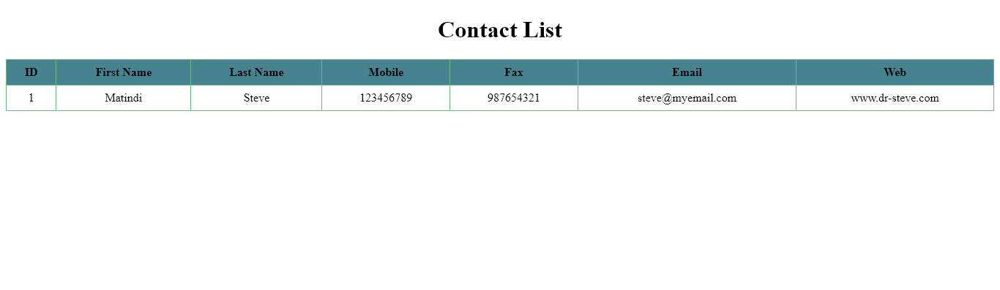

# Contacts Management System

## Overview

This Contacts Management System is a simple web application designed to store and display contact details. It allows users to view a list of contacts with PII details such as names, mobile numbers, fax numbers, email addresses, and web addresses.

---

## Features

- View a list of contacts.
- Easily add new contacts.
- Edit existing contact information.
- Delete contacts from the database.

## Prerequisites

1. Ensure you have a web server with PHP and MySQL installed.
2. Create a database named `contacts`.
3. Import the provided SQL schema file to set up the necessary table.
4. Place the `index.php` file in your server directory.
5. Open `index.php` in a web browser to view and manage contacts.

## Adding Sample Data

You can add sample data using phpMyAdmin or by running SQL queries. e.g.

```sql
INSERT INTO contacts (First, Last, Mobile, Fax, Email, Web)
VALUES ('steve', 'works', '1234567', '1234567', 'steveworks@youremail.com', 'www.stevemats.com');
```

## Styling

Basic CSS styles have been applied to enhance the visual appeal of the contact list. You can further customize the styles to suit your preferences.

```css
h1 {
  text-align: center;
}
table {
  border-collapse: collapse;
  width: 100%;
}

th,
td {
  border: 1px solid rgb(104, 187, 124);
  padding: 8px;
  text-align: center;
}

th {
  background-color: #478291;
}
```

## Note

NB// Remember to add DB connection details.

e.g (default phpmyadmin details & db name locally)

```php
$servername = "localhost";
$username = "root";
$password = "";
$dbname = "contacts";
```

---

## Snap

- If you run everything correctly you should be able to see this with your updated details in the `index.php`:



---
